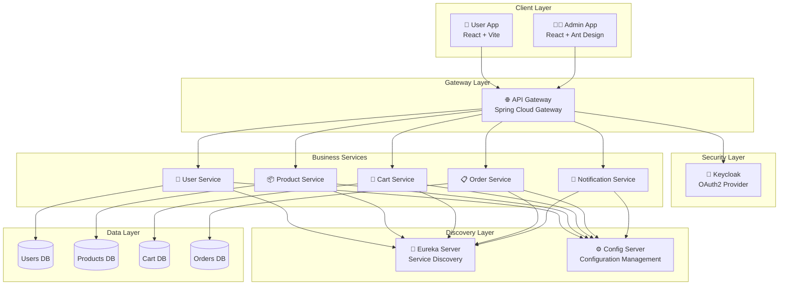

# 🛒 Cloud Kart - Enterprise E-commerce Platform

<div align="center">


[](https://www.oracle.com/java/)
[](https://spring.io/projects/spring-boot)
[](https://reactjs.org/)
[](https://www.postgresql.org/)
[](https://www.docker.com/)
[](https://www.keycloak.org/)
[](LICENSE)

[](https://github.com/harshal5-dev/cloud-kart)
[](https://github.com/harshal5-dev/cloud-kart/pulls)
[](https://github.com/harshal5-dev/cloud-kart/stargazers)
[](https://github.com/harshal5-dev/cloud-kart/network/members)

</div>

---

> **🚀 A modern, cloud-native e-commerce platform built with Spring Boot microservices architecture and React frontends. Showcasing enterprise-level development practices, OAuth2/Keycloak integration, and cloud-ready design patterns.**

---

## 📑 Table of Contents

- [✨ What Makes This Special?](#-what-makes-this-special)
- [🎮 Demo & Features](#-demo--features)
- [🚀 Project Overview](#-project-overview)
- [🏗️ Architecture Overview](#️-architecture-overview)
- [🛠️ Technology Stack](#️-technology-stack)
- [🏁 Quick Start](#-quick-start)
- [📁 Project Structure](#-project-structure)
- [🔌 API Documentation](#-api-documentation)
- [🔧 Configuration](#-configuration)
- [🧪 Testing](#-testing)
- [📊 Monitoring](#-monitoring)
- [🚀 Deployment](#-deployment)
- [🛡️ Security](#️-security)
- [🗺️ Roadmap & Future Enhancements](#️-roadmap--future-enhancements)
- [🤝 Contributing](#-contributing)
- [📞 Support & Community](#-support--community)
- [📄 License](#-license)

---

## ✨ What Makes This Special?

🎯 **Production-Ready Architecture** - Enterprise-grade microservices with proper separation of concerns  
🔐 **Advanced Security** - OAuth2 + Keycloak integration with role-based access control  
⚡ **Full-Stack Experience** - React admin panel and user interfaces  
🐳 **Cloud Native** - Containerized services with Docker and multi-environment support  
📊 **Modern Stack** - Java 17, Spring Boot 3.x, React 19, Ant Design, Tailwind CSS

---

## 🎮 Demo & Features

### 🖥️ Admin Dashboard Features
- **👥 User Management** - Complete CRUD operations for users
- **📦 Product Catalog** - Advanced product management with categories
- **📊 Order Processing** - Real-time order tracking and management  
- **📈 Analytics Dashboard** - Business insights and metrics
- **🔐 Role-Based Access** - Secure admin-only features

### 🛍️ User Interface Features  
- **🔍 Product Discovery** - Advanced search and filtering
- **🛒 Shopping Cart** - Persistent cart across sessions
- **💳 Secure Checkout** - Multi-step checkout process
- **📱 Responsive Design** - Mobile-first responsive UI
- **👤 User Profile** - Account management and order history

### 🏗️ Architecture Highlights
- **🔄 Service Discovery** - Automatic service registration with Eureka
- **🌐 API Gateway** - Centralized routing and load balancing  
- **🔐 OAuth2 Security** - Keycloak integration for enterprise auth
- **📊 Health Monitoring** - Comprehensive service health checks
- **🐳 Container Ready** - Full Docker support with orchestration

## 🚀 Project Overview

Cloud Kart is a **full-stack, enterprise-grade e-commerce platform** built with cutting-edge technologies. This project demonstrates how to architect, develop, and deploy a production-ready microservices application with modern security practices and user interfaces.

### 🎯 Key Features

**🏗️ Architecture & Design**
- **Microservices Architecture** - 6+ independent, scalable services
- **Service Discovery** - Eureka-based service registration and discovery  
- **API Gateway** - Centralized routing with Spring Cloud Gateway
- **Configuration Management** - Externalized configuration with Spring Cloud Config

**🔐 Security & Authentication**
- **OAuth2 + Keycloak Integration** - Enterprise-grade authentication
- **Role-Based Access Control** - Admin and user role separation
- **JWT Token Security** - Stateless authentication across services
- **Resource Server Protection** - Secure API endpoints

**🎨 Frontend Applications**
- **React Admin Panel** - Feature-rich admin dashboard with Ant Design
- **React User Interface** - Modern e-commerce user experience
- **Responsive Design** - Mobile-first approach with Tailwind CSS
- **State Management** - Redux Toolkit for efficient state handling

**☁️ Cloud & DevOps**
- **Containerization** - Full Docker support with multi-environment configs
- **Database Per Service** - Independent PostgreSQL databases
- **Health Monitoring** - Comprehensive health checks and metrics
- **Environment Separation** - Dev, Prod, and Database-specific configurations

## 🏗️ Architecture Overview



### 🔧 Service Architecture

| Service | Port | Technology Stack | Database | Description |
|---------|------|------------------|----------|-------------|
| **🌐 API Gateway** | 8080 | Spring Cloud Gateway | - | Entry point, routing, load balancing |
| **📍 Eureka Server** | 8761 | Spring Cloud Netflix | - | Service discovery and registration |
| **⚙️ Config Server** | 8888 | Spring Cloud Config | - | Centralized configuration management |
| **👤 User Service** | 8081 | Spring Boot + OAuth2 | PostgreSQL | User management + Keycloak integration |
| **📦 Product Service** | 8082 | Spring Boot + JPA | PostgreSQL | Product catalog and inventory |
| **🛒 Cart Service** | 8084 | Spring Boot + JPA | PostgreSQL | Shopping cart operations |
| **📋 Order Service** | 8085 | Spring Boot + JPA | PostgreSQL | Order processing and management |
| **📧 Notification Service** | 8087 | Spring Boot + Events | PostgreSQL | Email/SMS notifications |

### 🎨 Frontend Applications

| Application | Technology Stack | Features |
|-------------|------------------|----------|
| **👨‍💼 Admin Panel** | React 19 + Ant Design + Redux | User management, product catalog, order processing |
| **👥 User App** | React 19 + Tailwind CSS + Redux | Shopping cart, product browsing, order history |

## 🛠️ Technology Stack

<div align="center">

### 🎯 Backend Technologies

| Technology | Version | Purpose |
|------------|---------|---------|
| ☕ **Java** | 17+ | Core programming language |
| 🍃 **Spring Boot** | 3.x | Application framework |
| ☁️ **Spring Cloud** | 2023.x | Microservices framework |
| 🔒 **Spring Security + OAuth2** | 6.x | Authentication & authorization |
| 📊 **Spring Data JPA** | 3.x | Data persistence layer |
| 🔧 **Maven** | 3.8+ | Dependency management |
| 🔐 **Keycloak** | 26.2.5 | Identity and access management |

### 🎨 Frontend Technologies

| Technology | Version | Purpose |
|------------|---------|---------|
| ⚛️ **React** | 19+ | UI library |
| 🎨 **Ant Design** | 5.25+ | Admin UI components |
| 🎯 **Tailwind CSS** | 4.1+ | Utility-first CSS framework |
| ⚡ **Vite** | Latest | Build tool and dev server |
| 🗃️ **Redux Toolkit** | 2.8+ | State management |
| 🧭 **React Router** | 7.6+ | Client-side routing |

### 🏗️ Infrastructure

| Technology | Version | Purpose |
|------------|---------|---------|
| 🐘 **PostgreSQL** | 15+ | Primary database |
| 🐳 **Docker** | Latest | Containerization |
| 🐙 **Docker Compose** | Latest | Multi-container orchestration |
| 📍 **Eureka** | 4.x | Service discovery |
| 🌐 **Spring Cloud Gateway** | 4.x | API gateway and routing |

### 📊 DevOps & Monitoring

| Tool | Purpose |
|------|---------|
| 🩺 **Spring Boot Actuator** | Health monitoring and metrics |
| 📈 **Micrometer** | Application metrics |
| 🏥 **Health Checks** | Service health monitoring |
| 📝 **Logging** | Centralized application logging |
| 🔍 **Distributed Tracing** | Request flow tracking |

</div>

## 🚦 Prerequisites

Before running this project, ensure you have the following installed:

- **Java 17+** ([Download](https://adoptium.net/))
- **Maven 3.8+** ([Download](https://maven.apache.org/download.cgi))
- **Docker & Docker Compose** ([Download](https://www.docker.com/get-started))
- **PostgreSQL 15+** ([Download](https://www.postgresql.org/download/))
- **Git** ([Download](https://git-scm.com/downloads))

## 🏁 Quick Start

> Get the full Cloud Kart e-commerce platform running in under 10 minutes! 

### 🚀 One-Command Setup (Recommended)

```bash
# Clone and start everything with Docker Compose
git clone https://github.com/harshal5-dev/cloud-kart.git
cd cloud-kart
docker-compose -f docker/dev/docker-compose.yml up -d
```

**🎉 That's it!** Your services will be available at:
- 🌐 **API Gateway**: http://localhost:8080
- 📍 **Eureka Dashboard**: http://localhost:8761  
- 🔐 **Keycloak Admin**: http://localhost:9080 (admin/admin)
- 👤 **User Service**: http://localhost:8081
- 📦 **Product Service**: http://localhost:8082

---

### 📋 Step-by-Step Setup

#### 1️⃣ Clone the Repository

```bash
git clone https://github.com/harshal5-dev/cloud-kart.git
cd cloud-kart
```

#### 2️⃣ Environment Configuration

```bash
# The project includes ready-to-use environment configurations
# Check the .env file in the root directory
cat .env
```

#### 3️⃣ Infrastructure Setup

```bash
# Start databases and Keycloak
cd docker/dev
docker-compose up -d

# Verify services are running
docker-compose ps
```

#### 4️⃣ Build Backend Services

```bash
# Build all microservices (from project root)
cd ../..
./mvnw clean install -DskipTests

# Or build individual services
cd user-service && ./mvnw clean install
```

#### 5️⃣ Start Backend Services

Choose your preferred method:

### 5. Start Services

#### Option A: Docker Compose (Recommended)
```bash
# Start all services
docker-compose up -d

# Check services status
docker-compose ps

# View logs
docker-compose logs -f [service-name]
```

#### Option B: Manual Startup
```bash
# Start in order:
# 1. Eureka Server
cd eureka-server && java -jar target/eureka-server-*.jar &

# 2. Config Server
cd config-server && java -jar target/config-server-*.jar &

# 3. API Gateway
cd api-gateway && java -jar target/api-gateway-*.jar &

# 4. Business Services
cd user-service && java -jar target/user-service-*.jar &
cd product-service && java -jar target/product-service-*.jar &
# ... continue for other services
```

### 6. Verify Setup
```bash
# Check Eureka Dashboard
curl http://localhost:8761

# Check API Gateway health
curl http://localhost:8080/actuator/health

# Test API endpoint
curl -X GET http://localhost:8080/api/v1/products
```

## 📁 Project Structure

<div align="center">

### 🏗️ High-Level Architecture

</div>

```text
cloud-kart/
├── 🌐 api-gateway/             # Spring Cloud Gateway - API routing & load balancing
├── � eureka-server/           # Netflix Eureka - Service discovery
├── ⚙️ config-server/           # Spring Cloud Config - Configuration management
├── � bom/                     # Bill of Materials - Dependency management
├── 
├── 🎯 BUSINESS SERVICES
├── ├── � user-service/        # User management + Keycloak integration
├── ├── � product-service/     # Product catalog & inventory
├── ├── � cart-service/        # Shopping cart operations
├── ├── � order-service/       # Order processing & management
├── └── � notification-service/ # Email/SMS notifications
├── 
├── 🎨 FRONTEND APPLICATIONS
├── ├── client/
├── │   ├── 👨‍💼 admin/         # React + Ant Design - Admin dashboard
├── │   └── � user/          # React + Tailwind - User interface
├── 
├── 🐳 INFRASTRUCTURE
├── ├── docker/
├── │   ├── 🗄️ databases/      # Database configurations
├── │   ├── � dev/           # Development environment
├── │   ├── 🔐 keycloak/      # Keycloak setup
├── │   └── 🚀 prod/          # Production environment
├── 
├── � DATA & SCRIPTS
├── ├── scripts/              # Database seed data & utilities
├── │   ├── categoryData.json
├── │   ├── productData.json
├── │   ├── userData.json
├── │   └── ...
├── 
├── � CONFIGURATION
├── ├── .env                  # Environment variables
├── ├── .gitignore           # Git ignore rules
├── └── README.md            # This documentation
```

### 📋 Service Details

| 📁 Directory | 🏷️ Type | 🔧 Technology | 🎯 Purpose |
|--------------|---------|---------------|------------|
| `api-gateway/` | 🌐 Gateway | Spring Cloud Gateway | Request routing, load balancing, CORS |
| `eureka-server/` | 📍 Discovery | Netflix Eureka | Service registration & discovery |
| `config-server/` | ⚙️ Config | Spring Cloud Config | Centralized configuration |
| `user-service/` | 👤 Business | Spring Boot + OAuth2 | Authentication via Keycloak |
| `product-service/` | 📦 Business | Spring Boot + JPA | Product catalog management |
| `cart-service/` | 🛒 Business | Spring Boot + JPA | Shopping cart operations |
| `order-service/` | 📋 Business | Spring Boot + JPA | Order processing |
| `notification-service/` | � Business | Spring Boot + Events | Async notifications |

### 🎨 Frontend Structure

```text
client/
├── admin/                    # 👨‍💼 Admin Dashboard
│   ├── src/
│   │   ├── components/       # Reusable UI components
│   │   ├── pages/           # Admin pages (users, products, orders)
│   │   ├── store/           # Redux store configuration
│   │   └── services/        # API service calls
│   ├── Dockerfile           # Container configuration
│   └── package.json         # React 19 + Ant Design
│
└── user/                    # 👥 User Interface  
    ├── src/
    │   ├── components/      # Shopping components
    │   ├── pages/          # User pages (shop, cart, profile)
    │   ├── store/          # State management
    │   └── services/       # API integrations
    └── package.json        # React 19 + Tailwind CSS
```

## 🔌 API Documentation

### Core Endpoints

#### Authentication
```bash
# User Registration
POST /api/v1/auth/register
Content-Type: application/json
{
  "username": "johndoe",
  "email": "john@example.com",
  "password": "securePassword123",
  "firstName": "John",
  "lastName": "Doe"
}

# User Login
POST /api/v1/auth/login
Content-Type: application/json
{
  "email": "john@example.com",
  "password": "securePassword123"
}
```

#### Products
```bash
# Get all products
GET /api/v1/products?page=0&size=10

# Get product by ID
GET /api/v1/products/{productId}

# Create product (Admin only)
POST /api/v1/products
Authorization: Bearer {jwt-token}
Content-Type: application/json
{
  "name": "iPhone 15 Pro",
  "description": "Latest iPhone model",
  "price": 999.99,
  "categoryId": 1,
  "sku": "IPH15PRO001"
}
```

#### Cart Operations
```bash
# Add item to cart
POST /api/v1/cart/items
Authorization: Bearer {jwt-token}
Content-Type: application/json
{
  "productId": 1,
  "quantity": 2
}

# Get user cart
GET /api/v1/cart
Authorization: Bearer {jwt-token}
```

#### Orders
```bash
# Create order
POST /api/v1/orders
Authorization: Bearer {jwt-token}
Content-Type: application/json
{
  "shippingAddress": {
    "street": "123 Main St",
    "city": "New York",
    "state": "NY",
    "zipCode": "10001"
  }
}

# Get order history
GET /api/v1/orders
Authorization: Bearer {jwt-token}
```

### Swagger Documentation
- **API Gateway Swagger**: http://localhost:8080/swagger-ui.html
- **Individual Service Docs**: http://localhost:{port}/swagger-ui.html

## 🔧 Configuration

### Environment Variables
```bash
# Database Configuration
DB_HOST=localhost
DB_PORT=5432
DB_NAME=cloudkart
DB_USERNAME=admin
DB_PASSWORD=password

# Redis Configuration
REDIS_HOST=localhost
REDIS_PORT=6379

# JWT Configuration
JWT_SECRET=your-secret-key
JWT_EXPIRATION=86400000

# RabbitMQ Configuration
RABBITMQ_HOST=localhost
RABBITMQ_PORT=5672
RABBITMQ_USERNAME=guest
RABBITMQ_PASSWORD=guest
```

### Service Configuration
Each service can be configured via `application.yml` files in the `config-repo/` directory:

```yaml
# Example: user-service.yml
server:
  port: 8081

spring:
  datasource:
    url: jdbc:postgresql://${DB_HOST}:${DB_PORT}/${DB_NAME}
    username: ${DB_USERNAME}
    password: ${DB_PASSWORD}
  
  jpa:
    hibernate:
      ddl-auto: update
    show-sql: false

eureka:
  client:
    service-url:
      defaultZone: http://localhost:8761/eureka/
```

## 🧪 Testing

### Running Tests
```bash
# Run all tests
mvn test

# Run tests for specific service
cd user-service && mvn test

# Run integration tests
mvn test -Dtest=*IntegrationTest

# Generate test coverage report
mvn jacoco:report
```

### Test Categories
- **Unit Tests** - Individual component testing
- **Integration Tests** - Service integration testing
- **Contract Tests** - API contract validation
- **End-to-End Tests** - Complete workflow testing

## 📊 Monitoring

### Health Checks
- **Eureka Dashboard**: http://localhost:8761
- **Gateway Health**: http://localhost:8080/actuator/health
- **Service Health**: http://localhost:{port}/actuator/health

### Metrics & Monitoring
- **Prometheus**: http://localhost:9090
- **Grafana**: http://localhost:3000
- **Zipkin**: http://localhost:9411

### Logging
```bash
# View service logs
docker-compose logs -f user-service

# View all logs
docker-compose logs -f

# Access ELK Stack
# Kibana: http://localhost:5601
```

## 🚀 Deployment

### Docker Deployment
```bash
# Build and deploy all services
docker-compose up --build -d

# Scale specific service
docker-compose up --scale user-service=3 -d

# Update specific service
docker-compose up --build -d user-service
```

### Production Deployment
```bash
# Build production images
docker-compose -f docker-compose.prod.yml build

# Deploy to production
docker-compose -f docker-compose.prod.yml up -d
```

## 🛡️ Security

### Authentication Flow
1. User registers/logs in via `/auth` endpoints
2. JWT token issued with user claims
3. Token validated at API Gateway
4. Authenticated requests forwarded to services

### Security Features
- **JWT Authentication** - Stateless authentication
- **Role-based Authorization** - CUSTOMER/ADMIN roles
- **API Rate Limiting** - Request throttling
- **CORS Configuration** - Cross-origin protection
- **Input Validation** - Request payload validation

## 🤝 Contributing

We welcome contributions! Please follow these steps:

1. **Fork the repository**
2. **Create feature branch**: `git checkout -b feature/amazing-feature`
3. **Commit changes**: `git commit -m 'Add amazing feature'`
4. **Push to branch**: `git push origin feature/amazing-feature`
5. **Open Pull Request**

### Development Guidelines
- Follow Java coding standards
- Write comprehensive tests
- Update documentation
- Use conventional commit messages

## 📝 License

This project is licensed under the MIT License - see the [LICENSE](LICENSE) file for details.

## 👥 Authors

- **Harshal** - *Initial work* - [@harshal5-dev](https://github.com/harshal5-dev)

## 🙏 Acknowledgments

- Spring Boot and Spring Cloud communities
- Microservices design patterns and best practices
- Open source contributors

## 📞 Support

For support and questions:
- **GitHub Issues**: [Create an issue](https://github.com/harshal5-dev/cloud-kart/issues)
- **Email**: harshalganbote55@gmail.com

---

⭐ **Star this repository if you find it helpful!**

## 🗺️ Roadmap & Future Enhancements

### 🚀 Phase 1 - Core Features (Completed ✅)
- [x] Microservices architecture with Spring Boot
- [x] OAuth2 + Keycloak integration  
- [x] React admin dashboard with Ant Design
- [x] Docker containerization
- [x] Service discovery with Eureka

### 📈 Phase 2 - Advanced Features (In Progress 🚧)
- [ ] **Redis Caching Layer** - Performance optimization
- [ ] **Event Sourcing** - Event-driven architecture
- [ ] **GraphQL API** - Alternative to REST APIs
- [ ] **Real-time Notifications** - WebSocket integration
- [ ] **Advanced Analytics** - Business intelligence dashboard

### ☁️ Phase 3 - Cloud & Scale (Planned 📋)  
- [ ] **Kubernetes Deployment** - Container orchestration
- [ ] **CI/CD Pipeline** - GitHub Actions integration
- [ ] **AWS/Azure Integration** - Cloud-native deployment
- [ ] **Mobile Applications** - React Native or Flutter
- [ ] **Performance Monitoring** - APM integration

### 🔧 Technical Debt & Improvements
- [ ] **Comprehensive Testing** - Increase test coverage to 80%+
- [ ] **API Documentation** - OpenAPI/Swagger improvements
- [ ] **Security Hardening** - Security audit and improvements
- [ ] **Code Quality** - SonarQube integration

---

## 🤝 Contributing

We love contributions! Here's how you can help make Cloud Kart even better:

### 🎯 Ways to Contribute
- 🐛 **Bug Reports** - Found a bug? [Open an issue](https://github.com/harshal5-dev/cloud-kart/issues)
- ✨ **Feature Requests** - Have an idea? [Start a discussion](https://github.com/harshal5-dev/cloud-kart/discussions)
- 📝 **Documentation** - Improve our docs and examples
- 🧪 **Testing** - Add tests or improve existing ones
- 🎨 **UI/UX** - Enhance the frontend experience

### 📋 Development Workflow
1. **Fork** the repository
2. **Create** a feature branch: `git checkout -b feature/amazing-feature`
3. **Make** your changes with proper tests
4. **Commit** using [conventional commits](https://conventionalcommits.org/): `git commit -m 'feat: add amazing feature'`
5. **Push** to your branch: `git push origin feature/amazing-feature`
6. **Open** a Pull Request with detailed description

### 📐 Development Guidelines
- ✅ Follow Java coding standards (Google Style)
- 🧪 Write unit and integration tests
- 📖 Update documentation for new features  
- 🔍 Ensure code quality with SonarQube
- 🎯 Keep PRs focused and atomic

---

## 📞 Support & Community

<div align="center">

### 💬 Get Help & Connect

[](https://github.com/harshal5-dev/cloud-kart/discussions)
[](https://github.com/harshal5-dev/cloud-kart/issues)
[](mailto:harshalganbote55@gmail.com)

</div>

### 🆘 Getting Support
- **🐛 Bug Reports**: [Create an Issue](https://github.com/harshal5-dev/cloud-kart/issues/new)
- **💡 Feature Requests**: [Start a Discussion](https://github.com/harshal5-dev/cloud-kart/discussions/new)
- **📚 Documentation**: Check our [Wiki](https://github.com/harshal5-dev/cloud-kart/wiki)
- **💌 Direct Contact**: [harshalganbote55@gmail.com](mailto:harshalganbote55@gmail.com)

---

## 📄 License

This project is licensed under the **MIT License** - see the [LICENSE](LICENSE) file for details.

```
MIT License - You can use this code for learning, personal, or commercial projects!
```

---

## 🙏 Acknowledgments

Special thanks to the amazing open source community:

- 🍃 **Spring Boot & Spring Cloud** teams for the excellent frameworks
- ⚛️ **React & Ant Design** communities for beautiful UI components  
- 🔐 **Keycloak** team for robust identity management
- 🐳 **Docker** for simplifying containerization
- 👥 **All contributors** who help improve this project

---

<div align="center">


### 🎉 Show Your Support

If this project helped you or you find it interesting, please consider:

⭐ **Starring** the repository  
🔄 **Sharing** with your network  
🐛 **Contributing** by reporting issues  
💡 **Suggesting** new features  

---

**Built with ❤️ and ☕ by [Harshal](https://github.com/harshal5-dev)**

*"Learning never stops, and neither does building awesome software!"*

[](https://github.com/harshal5-dev/cloud-kart)
[](https://github.com/harshal5-dev/cloud-kart)

</div>
